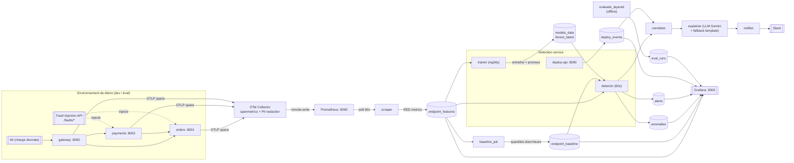
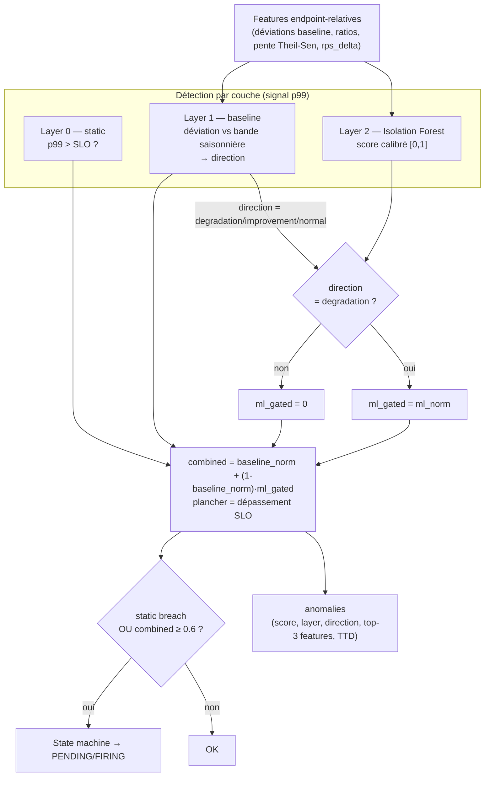
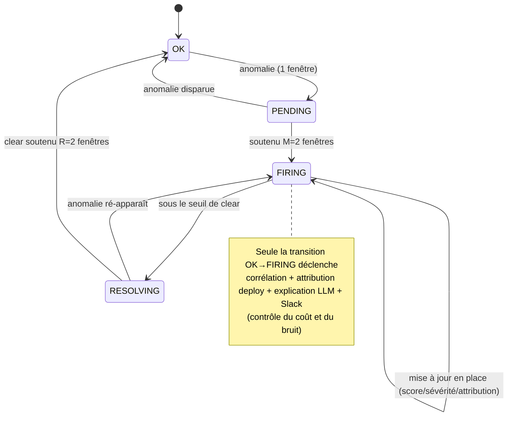
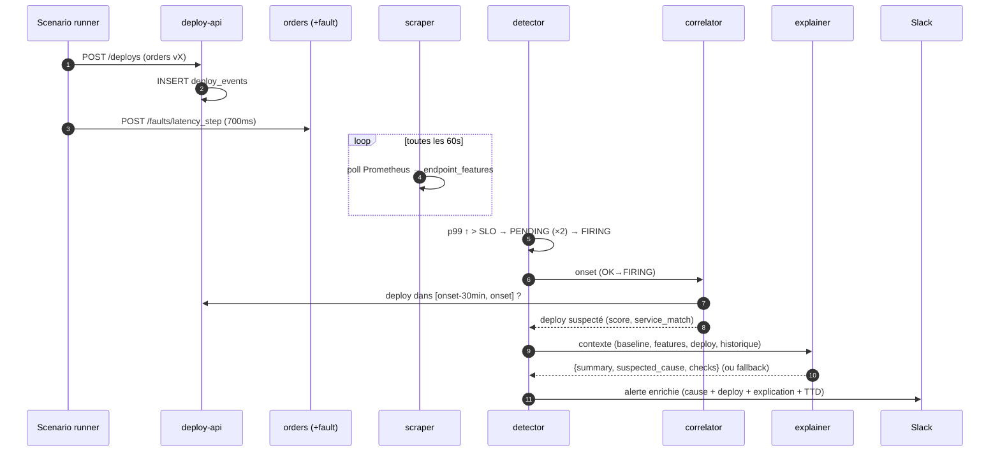
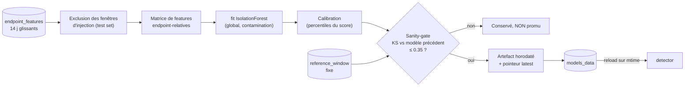
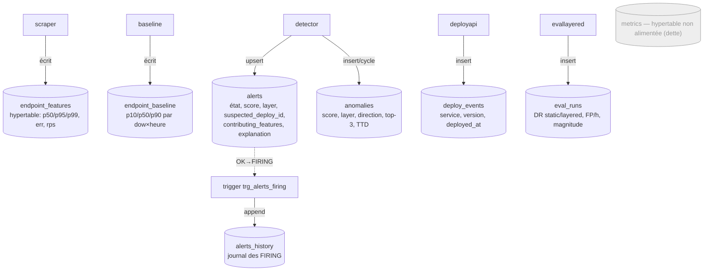

# Architecture — Cassandra

Documentation d'architecture de la plateforme. Les diagrammes sont en **Mermaid**
(rendus nativement sur GitHub). Référence de conception : [`design-spec.md`](design-spec.md).

Cassandra **détecte**, **attribue** et **explique** les dégradations de performance des
endpoints API. Le pipeline se décompose en 7 étapes : génération de trafic → ingestion
OTel → calcul de features → détection en couches → corrélation déploiement → explication
LLM → notification.

---

## 1. Architecture end-to-end

**Adaptations assumées vs spec** (voir `CLAUDE.md`) : `scraper` (poll Prometheus) au lieu de
continuous aggregates ; LLM = **Gemini** (au lieu d'Anthropic) ; le détecteur est une boucle
60 s (pas un service FastAPI). Ces choix sont documentés et n'altèrent pas le contrat.

---

## 2. Services & ports

| Service | Port (hôte) | Rôle |
|---|---|---|
| `gateway` | 8000 | Point d'entrée, proxy vers orders/payments |
| `orders` / `payments` | 8001 / 8002 | Services démo instrumentés OTel + API fault (interne) |
| `otel-collector` | 4317/4318/8888 | spanmetrics (RED) + redaction PII → Prometheus |
| `prometheus` | 9090 | Stockage métriques (remote-write) |
| `timescaledb` | 5434→5432 | Features, baseline, alertes, anomalies, déploiements, éval |
| `scraper` | — | Poll Prometheus → `endpoint_features` (60 s) |
| `baseline` | — | Recalcule `endpoint_baseline` (nightly / horaire) |
| `detector` | — | Détection en couches + state machine + corrélation + LLM |
| `trainer` | — | Réentraîne l'Isolation Forest (nightly) |
| `deploy-api` | 8090 | Registre des déploiements (`POST/GET /deploys`) |
| `grafana` | 3000 | Dashboards santé / évaluation / self-observabilité |

---

## 3. Pipeline de détection en couches (spec §5.4 / §8.3)

**Direction gating** : la couche ML ne contribue **que** sur une dégradation (jamais sur une
performance anormalement bonne). Le seuil `0.6` est **tuné** (`tune_contamination.py`, §9.2).
Un **TTD advisory** (extrapolation Theil-Sen vers le SLO) est calculé quand la tendance p99 est
haussière (§8.4).

---

## 4. Machine à états d'alerte (spec §5.5)

Clé de dédup : `(endpoint_id, signal_type)`. Une alerte FIRING **se met à jour en place** au
lieu de re-notifier. Hystérésis montante (M) et descendante (R) contre le flapping.

---

## 5. Séquence — scénario `bad_deploy` (la démo)

Objectif de fraîcheur (spec §5.2) : **< 3 min** event → Slack.

---

## 6. Cycle de vie du modèle ML (spec §8.3)

Artefact **versionné par timestamp**, ancien conservé, promotion **gated** par un contrôle de
shift de distribution sur une fenêtre de référence fixe. Réentraînement **nightly**. Les fautes
injectées sont réservées au **test set**, jamais à l'entraînement.

---

## 7. Modèle de données

| Table | Producteur | Consommateurs | Note |
|---|---|---|---|
| `endpoint_features` | scraper | detector, baseline, trainer, Grafana | hypertable time-series |
| `endpoint_baseline` | baseline_job | detector, features | quantiles saisonniers (dow×heure) |
| `alerts` | detector | Grafana, éval | 1 ligne par (endpoint, signal), upsert |
| `alerts_history` | trigger SQL | Grafana, self-obs | append-only des transitions FIRING |
| `anomalies` | detector | Grafana | 1 ligne par cycle scoré (anomaly store §6.3) |
| `deploy_events` | deploy-api | correlator, Grafana | registre control-plane |
| `eval_runs` | evaluate_layered | Grafana (dashboard éval) | résultats de campagne |
| `metrics` | — | — | **non alimentée** (à supprimer, audit #4) |

---

## 8. Responsabilités par module (`detection-service/`)

| Module | Responsabilité |
|---|---|
| `scraper.py` | Poll Prometheus → `endpoint_features` |
| `baseline_job.py` | Quantiles saisonniers → `endpoint_baseline` (exclut les injections) |
| `features.py` | Features dérivées endpoint-relatives (math pure) |
| `baseline_utils.py` | SLOs, lookup baseline, `pg_dow`, déviation |
| `ml_model.py` | Isolation Forest, calibration, attribution, cycle de vie artefact |
| `train_model.py` | Entraînement + sanity-gate + promotion |
| `ttd.py` | Alerte précoce TTD (extrapolation Theil-Sen) |
| `detector.py` | Boucle 60 s : scoring 3 couches, state machine, orchestration |
| `correlator.py` | Corrélation injection (ground-truth) + déploiement (causal 30 min) |
| `explainer.py` | Contexte + prompt LLM + validation JSON + fallback template |
| `notifier.py` | Message Slack enrichi |
| `deploy_api.py` | API registre de déploiements (FastAPI, pydantic) |
| `evaluate_layered.py` | Évaluation offline layered vs static + sensibilité |
| `evaluation.py` | Matching alertes ↔ ground-truth |
| `explanation_rubric.py` | Notation qualité des explications LLM |
| `compare_supervised.py` | Comparaison supervisé vs non-supervisé (stretch) |
| `tests/` | Suite pytest (logique pure) |
