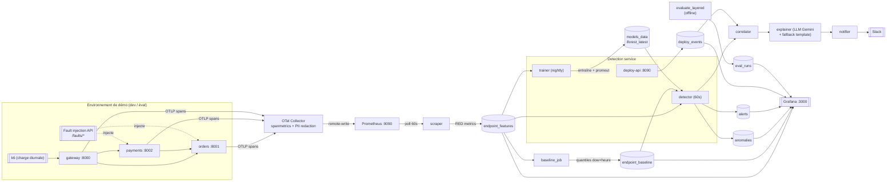
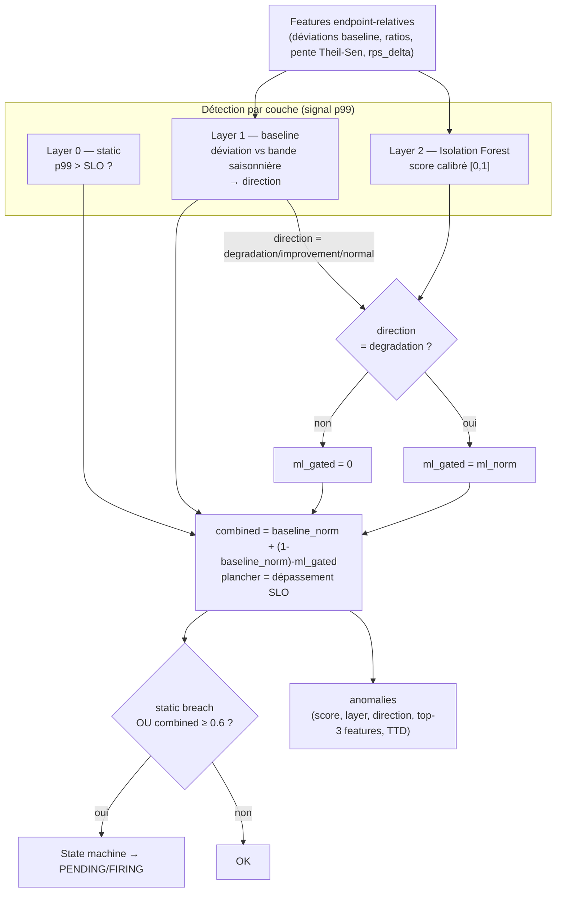
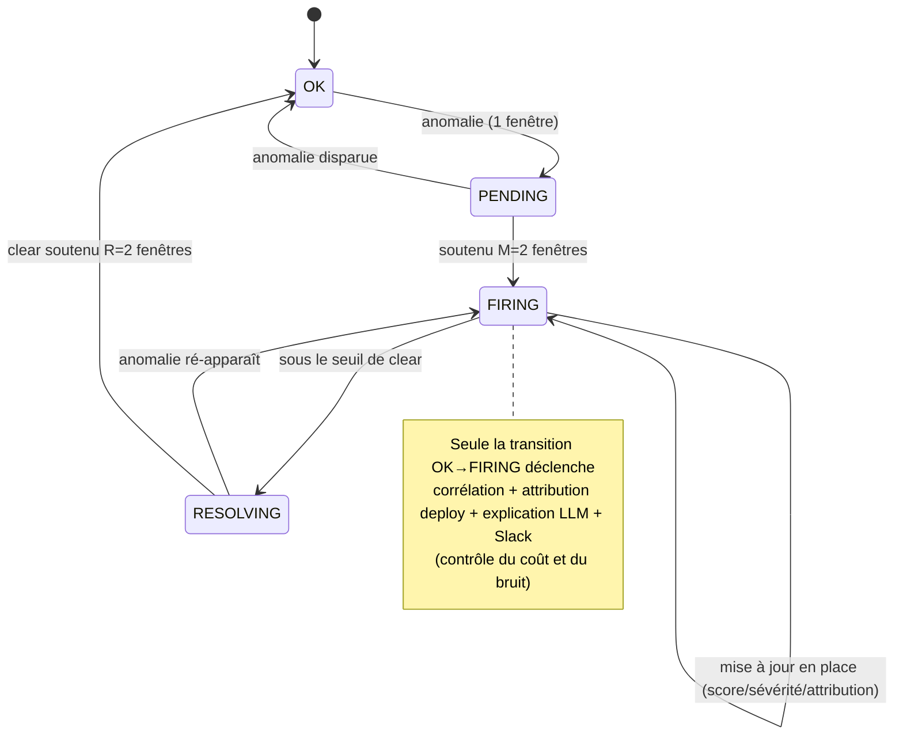
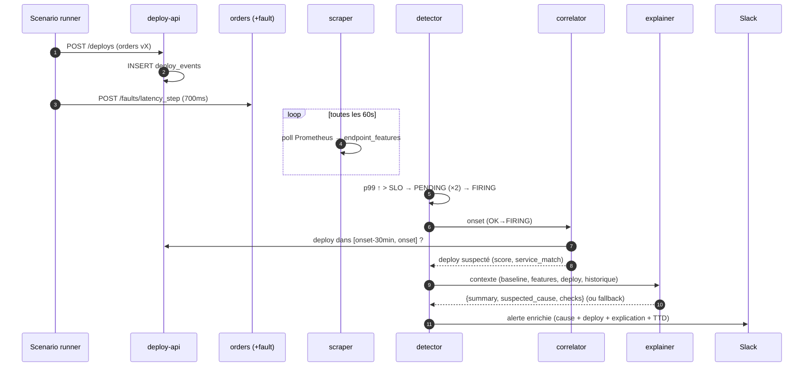
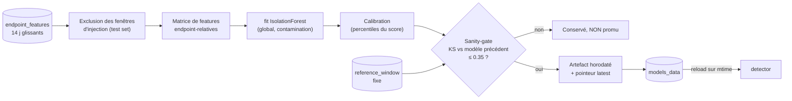
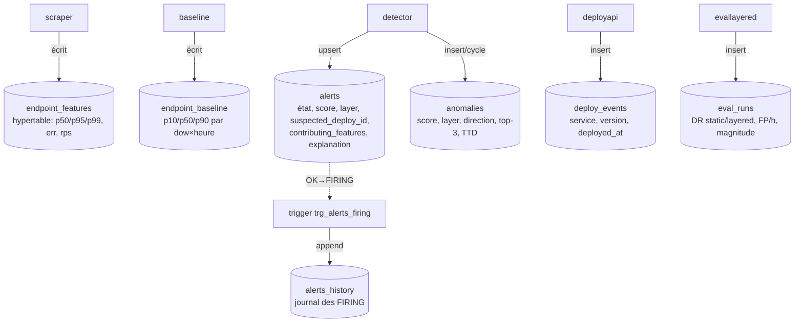

# Architecture — Cassandra

Documentation d'architecture de la plateforme. Les diagrammes sont en **Mermaid**
(rendus nativement sur GitHub). Référence de conception : [`design-spec.md`](design-spec.md).

Cassandra **détecte**, **attribue** et **explique** les dégradations de performance des
endpoints API. Le pipeline se décompose en 7 étapes : génération de trafic → ingestion
OTel → calcul de features → détection en couches → corrélation déploiement → explication
LLM → notification.

---

## 1. Architecture end-to-end


```mermaid
flowchart LR
    subgraph demo["Environnement de démo (dev / éval)"]
        k6[["k6 (charge diurnale)"]]
        fault[["Fault injection API<br/>/faults/*"]]
        gw["gateway :8000"]
        orders["orders :8001"]
        payments["payments :8002"]
        k6 --> gw --> orders
        gw --> payments --> orders
        fault -.injecte.-> orders
        fault -.injecte.-> payments
    end

    orders -- OTLP spans --> otel["OTel Collector<br/>spanmetrics + PII redaction"]
    payments -- OTLP spans --> otel
    gw -- OTLP spans --> otel
    otel -- remote-write --> prom["Prometheus :9090"]

    prom -- poll 60s --> scraper["scraper"]
    scraper -- RED metrics --> ef[("endpoint_features")]
    baseline["baseline_job"] -- quantiles dow×heure --> eb[("endpoint_baseline")]
    ef --> baseline

    subgraph detsvc["Detection service"]
        detector["detector (60s)"]
        trainer["trainer (nightly)"]
        deployapi["deploy-api :8090"]
    end

    ef --> detector
    eb --> detector
    model[("models_data<br/>iforest_latest")] --> detector
    trainer -- entraîne + promeut --> model
    ef --> trainer

    detector --> alerts[("alerts")]
    detector --> anomalies[("anomalies")]
    detector --> corr["correlator"]
    deploystore[("deploy_events")] --> corr
    deployapi --> deploystore
    corr --> expl["explainer (LLM Gemini<br/>+ fallback template)"]
    expl --> notif["notifier"]
    notif --> slack[["Slack"]]

    ef --> grafana[["Grafana :3000"]]
    eb --> grafana
    anomalies --> grafana
    alerts --> grafana
    deploystore --> grafana
    evalruns[("eval_runs")] --> grafana
    evallayered["evaluate_layered<br/>(offline)"] --> evalruns
```

**Adaptations assumées vs spec** (voir `CLAUDE.md`) : `scraper` (poll Prometheus) au lieu de
continuous aggregates ; LLM = **Gemini** (au lieu d'Anthropic) ; le détecteur est une boucle
60 s (pas un service FastAPI). Ces choix sont documentés et n'altèrent pas le contrat.

---

## 2. Services & ports

| Service | Port (hôte) | Rôle |
|---|---|---|
| `gateway` | 8000 | Point d'entrée, proxy vers orders/payments |
| `orders` / `payments` | 8001 / 8002 | Services démo instrumentés OTel + API fault (interne) |
| `otel-collector` | 4317/4318/8888 | spanmetrics (RED) + redaction PII → Prometheus |
| `prometheus` | 9090 | Stockage métriques (remote-write) |
| `timescaledb` | 5434→5432 | Features, baseline, alertes, anomalies, déploiements, éval |
| `scraper` | — | Poll Prometheus → `endpoint_features` (60 s) |
| `baseline` | — | Recalcule `endpoint_baseline` (nightly / horaire) |
| `detector` | — | Détection en couches + state machine + corrélation + LLM |
| `trainer` | — | Réentraîne l'Isolation Forest (nightly) |
| `deploy-api` | 8090 | Registre des déploiements (`POST/GET /deploys`) |
| `grafana` | 3000 | Dashboards santé / évaluation / self-observabilité |

---

## 3. Pipeline de détection en couches (spec §5.4 / §8.3)


```mermaid
flowchart TD
    feat["Features endpoint-relatives<br/>(déviations baseline, ratios, pente Theil-Sen, rps_delta)"]

    subgraph layers["Détection par couche (signal p99)"]
        L0["Layer 0 — static<br/>p99 &gt; SLO ?"]
        L1["Layer 1 — baseline<br/>déviation vs bande saisonnière<br/>→ direction"]
        L2["Layer 2 — Isolation Forest<br/>score calibré [0,1]"]
    end

    feat --> L1
    feat --> L2
    L1 -- "direction = degradation/improvement/normal" --> gate{"direction<br/>= degradation ?"}
    L2 --> gate
    gate -- non --> ml0["ml_gated = 0"]
    gate -- oui --> mln["ml_gated = ml_norm"]

    L0 --> comb
    L1 --> comb
    ml0 --> comb
    mln --> comb
    comb["combined = baseline_norm + (1-baseline_norm)·ml_gated<br/>plancher = dépassement SLO"]

    comb --> fire{"static breach<br/>OU combined ≥ 0.6 ?"}
    fire -- oui --> sm["State machine → PENDING/FIRING"]
    fire -- non --> ok["OK"]
    comb --> store["anomalies<br/>(score, layer, direction, top-3 features, TTD)"]
```

**Direction gating** : la couche ML ne contribue **que** sur une dégradation (jamais sur une
performance anormalement bonne). Le seuil `0.6` est **tuné** (`tune_contamination.py`, §9.2).
Un **TTD advisory** (extrapolation Theil-Sen vers le SLO) est calculé quand la tendance p99 est
haussière (§8.4).

---

## 4. Machine à états d'alerte (spec §5.5)


```mermaid
stateDiagram-v2
    [*] --> OK
    OK --> PENDING : anomalie (1 fenêtre)
    PENDING --> FIRING : soutenu M=2 fenêtres
    PENDING --> OK : anomalie disparue
    FIRING --> RESOLVING : sous le seuil de clear
    RESOLVING --> FIRING : anomalie ré-apparaît
    RESOLVING --> OK : clear soutenu R=2 fenêtres
    FIRING --> FIRING : mise à jour en place (score/sévérité/attribution)

    note right of FIRING
        Seule la transition OK→FIRING déclenche
        corrélation + attribution deploy + explication LLM + Slack
        (contrôle du coût et du bruit)
    end note
```

Clé de dédup : `(endpoint_id, signal_type)`. Une alerte FIRING **se met à jour en place** au
lieu de re-notifier. Hystérésis montante (M) et descendante (R) contre le flapping.

---

## 5. Séquence — scénario `bad_deploy` (la démo)


```mermaid
sequenceDiagram
    autonumber
    participant CI as Scenario runner
    participant DA as deploy-api
    participant OR as orders (+fault)
    participant SC as scraper
    participant DT as detector
    participant CO as correlator
    participant LLM as explainer
    participant SL as Slack

    CI->>DA: POST /deploys (orders vX)
    DA->>DA: INSERT deploy_events
    CI->>OR: POST /faults/latency_step (700ms)
    loop toutes les 60s
        SC->>SC: poll Prometheus → endpoint_features
    end
    DT->>DT: p99 ↑ > SLO → PENDING (×2) → FIRING
    DT->>CO: onset (OK→FIRING)
    CO->>DA: deploy dans [onset-30min, onset] ?
    CO-->>DT: deploy suspecté (score, service_match)
    DT->>LLM: contexte (baseline, features, deploy, historique)
    LLM-->>DT: {summary, suspected_cause, checks} (ou fallback)
    DT->>SL: alerte enrichie (cause + deploy + explication + TTD)
```

Objectif de fraîcheur (spec §5.2) : **< 3 min** event → Slack.

---

## 6. Cycle de vie du modèle ML (spec §8.3)


```mermaid
flowchart LR
    hist[("endpoint_features<br/>14 j glissants")] --> excl["Exclusion des fenêtres<br/>d'injection (test set)"]
    excl --> matrix["Matrice de features<br/>endpoint-relatives"]
    matrix --> fit["fit IsolationForest<br/>(global, contamination)"]
    fit --> calib["Calibration<br/>(percentiles du score)"]
    calib --> gate{"Sanity-gate<br/>KS vs modèle précédent<br/>≤ 0.35 ?"}
    gate -- non --> keep["Conservé, NON promu"]
    gate -- oui --> promote["Artefact horodaté<br/>+ pointeur latest"]
    promote --> vol[("models_data")]
    vol -- reload sur mtime --> det["detector"]
    ref[("reference_window<br/>fixe")] --> gate
```

Artefact **versionné par timestamp**, ancien conservé, promotion **gated** par un contrôle de
shift de distribution sur une fenêtre de référence fixe. Réentraînement **nightly**. Les fautes
injectées sont réservées au **test set**, jamais à l'entraînement.

---

## 7. Modèle de données


```mermaid
flowchart TD
    scraper -->|écrit| ef[("endpoint_features<br/>hypertable: p50/p95/p99, err, rps")]
    baseline -->|écrit| eb[("endpoint_baseline<br/>p10/p50/p90 par dow×heure")]
    detector -->|upsert| al[("alerts<br/>état, score, layer, suspected_deploy_id,<br/>contributing_features, explanation")]
    trg["trigger trg_alerts_firing"] -->|append| ah[("alerts_history<br/>journal des FIRING")]
    al -.OK→FIRING.-> trg
    detector -->|insert/cycle| an[("anomalies<br/>score, layer, direction, top-3, TTD")]
    deployapi -->|insert| de[("deploy_events<br/>service, version, deployed_at")]
    evallayered -->|insert| er[("eval_runs<br/>DR static/layered, FP/h, magnitude")]
```

| Table | Producteur | Consommateurs | Note |
|---|---|---|---|
| `endpoint_features` | scraper | detector, baseline, trainer, Grafana | hypertable time-series |
| `endpoint_baseline` | baseline_job | detector, features | quantiles saisonniers (dow×heure) |
| `alerts` | detector | Grafana, éval | 1 ligne par (endpoint, signal), upsert |
| `alerts_history` | trigger SQL | Grafana, self-obs | append-only des transitions FIRING |
| `anomalies` | detector | Grafana | 1 ligne par cycle scoré (anomaly store §6.3) |
| `deploy_events` | deploy-api | correlator, Grafana | registre control-plane |
| `eval_runs` | evaluate_layered | Grafana (dashboard éval) | résultats de campagne |

---

## 8. Modèle parent-enfant — DAG de dépendances de service

Extension délibérée vs spec (documentée ici conformément à `CLAUDE.md`).

La stack de démo crée un graphe orienté acyclique (DAG) entre les endpoints
instrumentés : la gateway reçoit le trafic utilisateur et propage les appels
vers les services internes, qui peuvent eux-mêmes s'appeler en cascade.

```mermaid
graph LR
    GW_ORD["GET /api/orders/{order_id}<br/>(gateway)"]
    GW_ORDS["GET /api/orders<br/>(gateway)"]
    GW_PAY["POST /api/payments<br/>(gateway)"]
    SVC_ORD["GET /orders/{order_id}<br/>(orders)"]
    SVC_ORDS["GET /orders<br/>(orders)"]
    SVC_PAY["POST /payments<br/>(payments)"]

    GW_ORD  -->|direct|  SVC_ORD
    GW_ORDS -->|direct|  SVC_ORDS
    GW_PAY  -->|direct|  SVC_PAY
    SVC_PAY -->|cascade| SVC_ORD
```

`GET /orders/{order_id}` a **deux parents** (gateway + payments) : c'est un DAG,
pas un arbre. La table `endpoint_relationships` (PRIMARY KEY composite) représente
ce cas correctement — un simple `parent_endpoint_id TEXT` sur `endpoint_features`
ne suffirait pas.

### Scénario de propagation (exemple `bad_deploy` sur orders)

```
POST /api/payments ──direct──► POST /payments ──cascade──► GET /orders/{order_id}
     gateway                      payments                       orders
  [FIRING 0.78]                [FIRING 0.82]                 [FIRING 0.91]
```

Quand `POST /api/payments` passe en FIRING (cycle N+1) :

1. `analyze_service_graph` charge le voisinage direct (1 saut).
2. `POST /payments` est enfant direct, score=0.82, direction=`degradation`.
3. Il entre dans `root_cause_candidates` avec `reason="degradation de dependance direct"`.
4. `service_attribution` est injecté dans `contributing_features` (JSONB, cycle N).
5. L'explainer (LLM ou fallback) lit ce contexte au moment FIRING pour formuler la cause.

> **Limite 1-hop :** `GET /orders/{order_id}` n'est pas visible depuis `POST /api/payments`
> (2 sauts). La chaîne complète est lisible en consultant l'alerte `POST /payments`.

### Schéma `service_attribution` (extrait de `contributing_features`)

```json
{
  "endpoint_id": "POST /api/payments",
  "service":     "gateway",
  "children": [
    { "endpoint_id": "POST /payments", "service": "payments",
      "call_type": "direct", "status": "degraded",
      "anomaly_score": 0.82, "direction": "degradation" }
  ],
  "parents": [],
  "root_cause_candidates": [
    { "endpoint_id": "POST /payments", "service": "payments",
      "call_type": "direct", "status": "degraded",
      "anomaly_score": 0.82, "direction": "degradation",
      "confidence_score": 0.74,
      "confidence": "high",
      "reason": "co-degradation correlee sur dependance direct -- causalite suspectee, non demontree" }
  ]
}
```

### Propriétés garanties par la DB

- **Aucun cycle** : trigger `trg_no_cycle` (CTE récursive `UNION`, `BEFORE INSERT/UPDATE`).
- **Aucune auto-référence** : `CHECK (parent_endpoint_id <> child_endpoint_id)`.
- **Pas de FK** vers `endpoint_features` : hypertable TimescaleDB incompatible avec FK
  sur table compressée.

### Invariant de détection

Les couches Layer 0/1/2 opèrent sur `endpoint_features` uniquement, sans aucune
dépendance à `endpoint_relationships`. L'analyse DAG est une étape **post-scoring,
best-effort**, wrappée dans un `try/except` dans `detector.py` : une erreur ici
ne bloque jamais une alerte.

### Design rationale — pourquoi cette architecture

**1. Pourquoi une table relation et non `parent_endpoint_id` sur `endpoint_features`**

Un `parent_endpoint_id TEXT` ne peut modéliser qu'un arbre. `GET /orders/{order_id}`
a deux parents distincts :

```
GET /api/orders/{order_id}  ──direct──►  GET /orders/{order_id}
POST /payments               ──cascade─►  GET /orders/{order_id}
```

La relation est un DAG. La table `endpoint_relationships` avec PK composite
`(parent_endpoint_id, child_endpoint_id)` représente ce cas correctement.

**2. Topologie de la stack de démo**

```
        [gateway :8000]
        /       |       \
       /        |        \
GET /api/orders  GET /api/orders/{order_id}  POST /api/payments
       |                 |                          |
   direct            direct                      direct
       |                 |                          |
GET /orders        GET /orders/{order_id}     POST /payments
                          ^                         |
                          |                       cascade
                          +-------------------------+
                        (POST /payments valide la commande)
```

**3. Limitation actuelle : traversée 1-hop uniquement**

`analyze_service_graph` ne charge que le voisinage direct (1 saut) :

```sql
WHERE parent_endpoint_id = %s OR child_endpoint_id = %s
```

La cause profonde d'une chaîne `A → B → C` n'est visible depuis A que si B est
en dégradation. La chaîne complète est lisible en consultant l'alerte de B.

**Note : `anomaly_score` ≠ `confidence_score`**

`anomaly_score` mesure l'intensité de l'anomalie du voisin (est-il anomal ?).
`confidence_score` mesure la plausibilité du **lien causal** (est-il LA cause ?), calculé comme
`min(0.95, anomaly_score × call_type_weight)` avec `direct=0.90`, `cascade=0.65`. Plafond 0.95 :
la corrélation observée en 1 saut n'établit jamais une causalité certaine.

Exemple : `anomaly_score=0.95` sur cascade → `confidence_score=0.62` → niveau `medium` (pas `high`).

**4. Pourquoi cette limitation est acceptable**

- Chaque alerte conserve son propre contexte de voisinage — aucune alerte ne peut
  masquer en une autre.
- Une traversée multi-hop risquerait des fausses attributions : un nœud dégradé
  à 3 sauts peut être totalement indépendant.
- En pratique, le cas critique est la propagation directe (1 saut) : `gateway → service`.
  La chaîne `gateway → payments → orders` génère 3 alertes, chacune avec son candidat
  root-cause direct. L'opérateur peut reconstituer la chaîne en les consultant.
- L'extension multi-hop reste possible (P2) sans modifier l'architecture existante :
  il suffit d'étendre la requête SQL avec un CTE récursif limité en profondeur.

---

## 10. Responsabilités par module (`detection-service/`)

| Module | Responsabilité |
|---|---|
| `scraper.py` | Poll Prometheus → `endpoint_features` |
| `baseline_job.py` | Quantiles saisonniers → `endpoint_baseline` (exclut les injections) |
| `features.py` | Features dérivées endpoint-relatives (math pure) |
| `baseline_utils.py` | SLOs, lookup baseline, `pg_dow`, déviation |
| `ml_model.py` | Isolation Forest, calibration, attribution, cycle de vie artefact |
| `train_model.py` | Entraînement + sanity-gate + promotion |
| `ttd.py` | Alerte précoce TTD (extrapolation Theil-Sen) |
| `detector.py` | Boucle 60 s : scoring 3 couches, state machine, orchestration |
| `correlator.py` | Corrélation injection (ground-truth) + déploiement (causal 30 min) |
| `explainer.py` | Contexte + prompt LLM + validation JSON + fallback template |
| `notifier.py` | Message Slack enrichi |
| `deploy_api.py` | API registre de déploiements (FastAPI, pydantic) |
| `evaluate_layered.py` | Évaluation offline layered vs static + sensibilité |
| `evaluation.py` | Matching alertes ↔ ground-truth |
| `explanation_rubric.py` | Notation qualité des explications LLM |
| `compare_supervised.py` | Comparaison supervisé vs non-supervisé (stretch) |
| `tests/` | Suite pytest (logique pure) |
